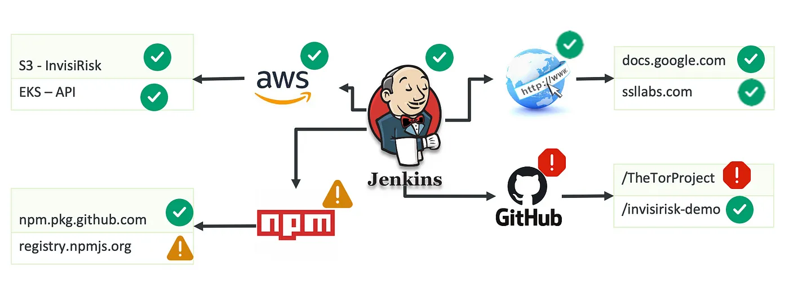

# Pipeline Security Engine

In recent years, there have been several high-profile security breaches that have exploited vulnerabilities in build pipelines. These breaches have exposed sensitive data, such as:

- Data exfiltration
- Code injection
- Denial of service (DoS) attacks
- Supply chain attacks
- Intellectual Property


Recent pipeline compromises like 3CX, Kaseya, CircleCI, SolarWinds, CodeCov, and others have highlighted the need for securing the build pipeline.

Pipeline Security Engine  provides detailed analysis and control of all the network transactions done by software builds. PSE deployments can be used to protect against such threats.

## About InvisiRisk
InvisiRisk provides unparalleled protection for your software supply chain by enforcing real-time security policies, inspecting bi-directional traffic, and adapting to new threats, ensuring zero-trust. Our Build Application Firewall provides continuous security for your build environment, without complex agents or limited scanners with a seamless, rapid setup for GitHub Actions and other CI/CDs.

- Agnostic, purpose-built security layer for build systems and Application Security Posture Managers
- TruSBOM™ with 100% accurate open-source manifest creation including accurate version information (DNA test for your source code’s open-source inventory).
- IR SBOM Enhance to find hidden open-source components in 3rd party application SBOMS
- IR Scorecard leverages rich content to prioritize health of your business, applications, and projects
- Software Supply Chain security beyond DAST/SAST/ASPM scanners for true pipeline ENFORCEMENT, to stop SolarWinds-type, MIME type, Typosquatting, and other modern security breaches
- Automate compliance with Security Packs and custom policies for any attestation type (NIST/CISA/Etc.)
- Implements zero trust model in build pipeline
- IR Build Application Firewall inspects traffic between build components to enforce policy in real time
- Partner Portal with customer data access, and step-by-step coaching from IR Team Members
- Network layer to ensure approved repositories, auth methods, and stop redirects of URLs, IPs, or Domains## About the Organization
InvisiRisk provides unparalleled protection for your software supply chain by enforcing real-time security policies, inspecting bi-directional traffic, and adapting to new threats, ensuring zero-trust. Our Build Application Firewall provides continuous security for your build environment, without complex agents or limited scanners with a seamless, rapid setup for GitHub Actions and other CI/CDs.

- Agnostic, purpose-built security layer for build systems and Application Security Posture Managers
- TruSBOM™ with 100% accurate open-source manifest creation including accurate version information (DNA test for your source code’s open-source inventory).
- IR SBOM Enhance to find hidden open-source components in 3rd party application SBOMS
- IR Scorecard leverages rich content to prioritize health of your business, applications, and projects
- Software Supply Chain security beyond DAST/SAST/ASPM scanners for true pipeline ENFORCEMENT, to stop SolarWinds-type, MIME type, Typosquatting, and other modern security breaches
- Automate compliance with Security Packs and custom policies for any attestation type (NIST/CISA/Etc.)
- Implements zero trust model in build pipeline
- IR Build Application Firewall inspects traffic between build components to enforce policy in real time
- Partner Portal with customer data access, and step-by-step coaching from IR Team Members
- Network layer to ensure approved repositories, auth methods, and stop redirects of URLs, IPs, or Domains


## Design
The PSE action sets up iptables rules to redirect all port 443 traffic to service container named PSE. The PSE container runs an SSL inspection proxy analyzing traffic flowing between your build and rest of the world. The PSE Action sets up CA certificate from the proxy service as a trusted certificate in your build container providing seamless service.

## Features
### Full Network Traffic Visibility
PSE scans all traffic from your build containers, providing full detailed view and control.

### Policy Control
Full policy control over what should be admitted to the build system. PSE uses [Rego](https://www.openpolicyagent.org/docs/latest/policy-language/) as the policy language.



The policy control allows for alert or block of traffic.

### Secret Scan
PSE scans all outgoing traffic for secrets. These requests can be blocked or can raise alert based on configuration.

## Input
Service Container Environments
 - GITHUB_TOKEN: Required. Github token with permission to write checks
 - POLICY_URL: URL from where to fetch policy
 - POLICY_AUTH_TOKEN: Bearer token used to authenticate with policy provider
 - POLICY_LOG: if set enable policy log
 
Action Input
 - github-token: Required Github token

## Usage
To use this action, add the following step to your workflow:

```
name: CI-Build

on:
  push:
  pull_request:

permissions:
  checks: write
  contents: read
  
jobs:
  build:

    services:
      # Run PSE as service -> Service must be named PSE.
      pse:
        image: invisirisk/pse
        env:
           GITHUB_TOKEN: ${{ secrets.GITHUB_TOKEN }} # should have permissions to write checks
           
           POLICY_URL: https://api.github.com/repos/invisirisk/policy/tarball/main #if set the URL to pull policy bundle from
           POLICY_AUTH_TOKEN: ${{ secrets.POLICY_AUTH_TOKEN }} # bearer auth token used when pull down policy
           POLICY_LOG: t # if set enables policy logging
           
           PSE_DEBUG_FLAG: --alsologtostderr # enable PSE logging
           
    container:
      image: node:19-alpine
      options: --cap-add=NET_ADMIN
      
    runs-on: ubuntu-latest
    
    steps:
     # setup PSE action
      - uses: invisirisk/pse-action@v1
        with:
          github-token: ${{ secrets.GITHUB_TOKEN }}
      - uses: actions/checkout@v3
      - run: make
```


## Policy Interface
PSE uses rego for policies. The PSE will fetch policy as a tarball from POLICY_URL. Policy auth can be set using POLICY_AUTH_TOKEN token.

Here is example policy for controlling access to git:
```
package git

import future.keywords.in

# generate alert
alert(repo, act) = output {
	item := [repo, act]

	output := sprintf("accessing repo %s with action %s", item)
}

# allow all access from invisirisk-demo
read_allow {
	glob.match("github.com/invisirisk-demo/**", [], input.details.repo)
	input.action in ["pull"]
}

# warn if build tries to access anything else

decision = {"result": "allow"} {
	read_allow
} else := {"result": "alert/warn", "details": alert(input.details.repo, input.action)}

```

### Policy return
Policy return should include the following details:
- result: allow, deny, alert/warn, alert/error, alert/crit
- details: if result is alert, message associated with the alert

## Output
The output is set as checks associated with the build.

## Restrictions
- Only works with Alpine, Debian, and Ubuntu container builds.
- Build container must allow root access to run iptables.
- Build container should be provided net_admin capability.

### Licensing
The project is licensed under [Apache License v2](https://www.apache.org/licenses/LICENSE-2.0).


## 

Visit https://www.invisirisk.com/ for more info. 

For support, please email support@invisirisk.com
